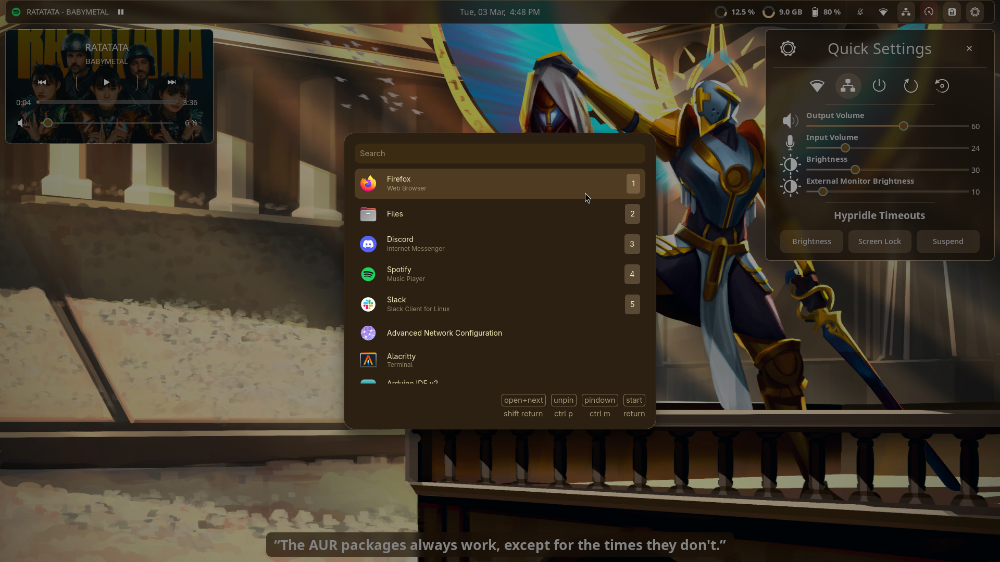
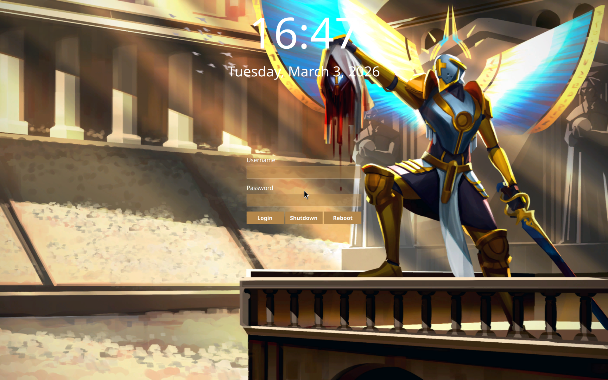

# My Dotfiles

See also: My personal [VSCode theme](https://github.com/harshkhandeparkar/personal-vscode-theme) and [Obsidian theme](https://github.com/harshkhandeparkar/personal-obsidian-theme).

### Installation Script
1. Clone this repository.
2. Run the `link.sh` script to link the dotfiles to the respective locations. Run with `--copy` flag to copy all the files instead of linking.
> **WARNING** THIS WILL DELETE EXISTING CONFIG DIRECTORIES.

### Packages
1. [Hyprland](https://hyprland.org) - Window Manager
2. [Hyprpaper](https://github.com/hyprwm/hyprpaper) - Wallpaper
3. [Hyprlock](https://github.com/https://wiki.hyprland.org/Hypr-Ecosystem/hyprlock/) - Lock screen
4. [Sway Notification Center](https://github.com/ErikReider/SwayNotificationCenter) - Notification Center
5. [BrightnessCTL](https://github.com/Hummer12007/brightnessctl) - For monitor brightness keybinds
6. [EWW](https://github.com/elkowar/eww) - For widgets
7. [Pipewire](https://wiki.archlinux.org/title/PipeWire) and [Wireplumber](https://wiki.archlinux.org/title/WirePlumber) - For audio controls
8. [Playerctl](https://github.com/altdesktop/playerctl) - For media controls
9. [Grimblast](https://github.com/hyprwm/contrib#grimblast) - For screenshots
10. [Kitty Terminal](https://github.com/kovidgoyal/kitty) - Default terminal
11. [Cava](https://github.com/karlstav/cava) - Audio visualizer
12. [NetworkManager](https://wiki.archlinux.org/title/NetworkManager) and [nmcli](https://wiki.archlinux.org/title/NetworkManager#nmcli_examples) - Network controls
13. ~~[Rofi (wayland fork)](https://github.com/lbonn/rofi) and [Rofi themes](https://github.com/lbonn/rofi/tree/wayland/themes) - App launcher menu~~
	- [Walker](https://github.com/abenz1267/walker) - App launcher

### Images
- Wallpaper: `~/.backgrounds/gabbie.png` from [Ultrakill](https://www.reddit.com/r/Ultrakill/comments/wrxar9/heres_the_image_at_the_end_of_act_2_for_a_desktop).
- Icons: `eww/img/` from [Yaru theme](https://github.com/ubuntu/yaru).

### Images

